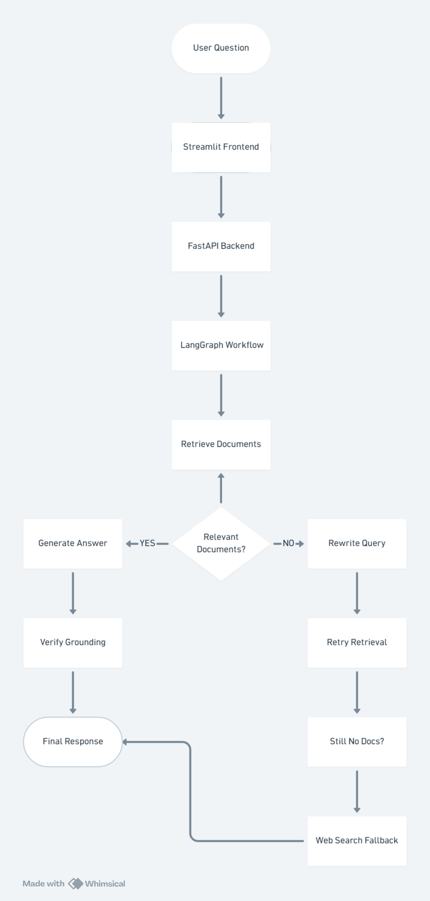
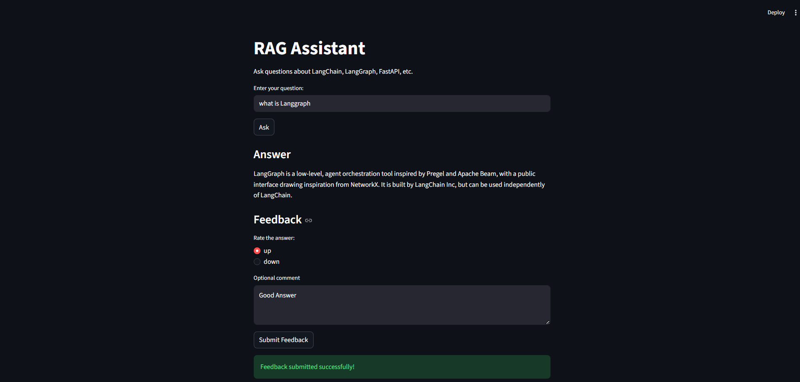
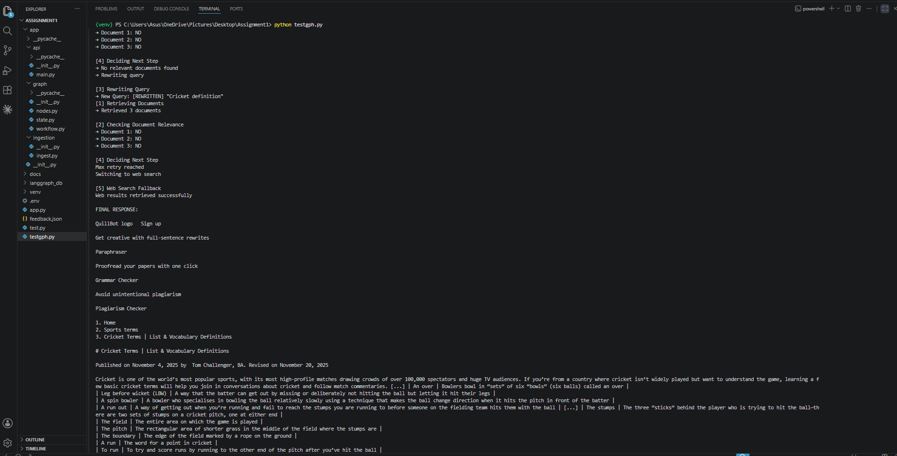
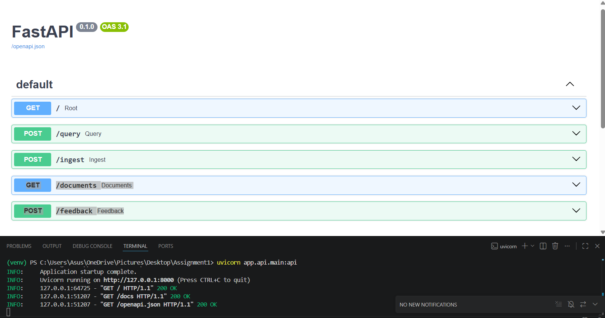
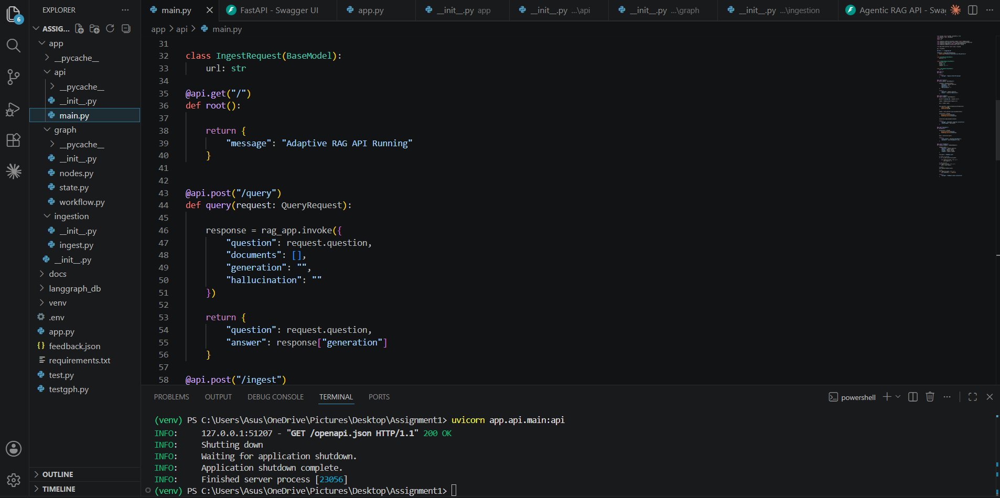

# Agentic RAG System

An end-to-end Adaptive Retrieval-Augmented Generation (RAG) system built using LangGraph, LangChain, FastAPI, Streamlit, ChromaDB, Groq LLMs, and Tavily Web Search.

This project demonstrates how modern AI systems can intelligently retrieve information, validate document relevance, rewrite failed queries, perform fallback web search, and generate grounded responses using a multi-step agentic workflow.

The system is designed to reduce hallucinations and improve answer reliability compared to traditional RAG pipelines.

---

# Features

- Adaptive RAG workflow using LangGraph
- Semantic document retrieval using ChromaDB
- HuggingFace sentence-transformer embeddings
- LLM-based document relevance filtering
- Automatic query rewriting for failed retrievals
- Retry mechanism for improved retrieval accuracy
- Tavily-powered web search fallback
- Hallucination / grounding verification
- FastAPI backend APIs
- Streamlit interactive frontend
- Feedback collection system
- Modular and scalable architecture

---

# Tech Stack

| Technology | Purpose |
|---|---|
| LangGraph | Workflow orchestration |
| LangChain | LLM framework |
| Groq | LLM inference |
| ChromaDB | Vector database |
| HuggingFace Embeddings | Semantic embeddings |
| Tavily Search | Web search fallback |
| FastAPI | Backend APIs |
| Streamlit | Frontend UI |
| Python | Core development |

---

# System Architecture



---

# Streamlit Frontend

Interactive Q&A interface built using Streamlit.



---

# Adaptive RAG Workflow

The system automatically rewrites queries and performs web fallback when relevant documents are not found.



---

# FastAPI Backend APIs

Production-ready API endpoints for querying, ingestion, document listing, and feedback collection.



---

# Project Structure

Modular architecture using LangGraph, FastAPI, and Streamlit.




# API Endpoints

| Method | Endpoint | Purpose |

| POST | /query | Ask questions to the RAG system |
| POST | /ingest | Add new documents/URLs |
| GET | /documents | List indexed documents |
| POST | /feedback | Submit feedback |

---

# Example API Request

## POST /query

### Request

```json
{
  "question": "What is LangGraph?"
}
```

### Response

```json
{
  "answer": "LangGraph is a low-level framework focused on agent orchestration."
}
```

---

# Setup Environment

## 1. Create Virtual Environment

```bash
python -m venv venv
```

---

## 2. Activate Environment

### Windows

```bash
venv\Scripts\activate
```

---

## 3. Install Dependencies

```bash
pip install -r requirements.txt
```

---

## 4. Create .env

```env
GROQ_API_KEY=your_groq_api_key
TAVILY_API_KEY=your_tavily_api_key
```

---

## 5. Ingest Documents

```bash
python app/ingestion/ingest.py
```

---

## 6. Run FastAPI Backend

```bash
uvicorn app.api.main:api --reload 
```

---

## 7. Run Streamlit Frontend

```bash
streamlit run streamlit_app.py
```

---

# Document Corpus

The system uses documentation pages from:

- LangChain
- LangGraph
- FastAPI

Documents are dynamically fetched using `WebBaseLoader` inside:

```text
app/ingestion/ingest.py
```

---

# Thought Process and Workflow Design

The primary goal of this project was to build an adaptive and self-corrective RAG pipeline instead of a traditional retrieval chatbot.

The workflow was designed to:

1. Retrieve semantically relevant information
2. Filter irrelevant chunks before generation
3. Retry retrieval using rewritten queries
4. Fall back to web search when retrieval fails
5. Verify whether generated answers are grounded in retrieved context

This architecture improves robustness and reduces hallucinated responses compared to standard RAG systems.

---

# Design Decisions and Tradeoffs

## Why LangGraph?

LangGraph was selected because it provides clean stateful orchestration and conditional routing between workflow nodes. This made it easier to implement retry logic, adaptive retrieval, and fallback mechanisms.

---

## Why ChromaDB?

ChromaDB was chosen as a lightweight local vector database suitable for semantic similarity search and rapid experimentation.

---

## Why Groq?

Groq provides fast LLM inference with low latency, making the system more responsive during interactive querying.

---

## Why Web Search Fallback?

Traditional RAG systems fail when relevant context is unavailable. The Tavily web search fallback enables retrieval of real-time information when the vector database lacks useful documents.

---

## Tradeoffs

- Local vector databases are easier to manage but less scalable than cloud-based vector stores.
- Lightweight embedding models improve speed but may slightly reduce retrieval accuracy.
- Web search fallback improves answer coverage but introduces external dependency latency.

---

# Chunking Strategy

Documents are split using `RecursiveCharacterTextSplitter` with:

- Chunk Size: 1000
- Chunk Overlap: 200

This helps preserve semantic context while ensuring chunks remain small enough for efficient retrieval.

---

# Embedding Strategy

The project uses:

```text
sentence-transformers/all-MiniLM-L6-v2
```

This embedding model was selected because it is lightweight, fast, and performs well for semantic similarity search tasks.

---

# Future Improvements

- Add PDF and DOCX ingestion support
- Add conversational memory/chat history
- Add source citations in UI
- Implement Docker deployment
- Add authentication system
- Add hybrid retrieval (BM25 + vector search)
- Improve hallucination verification

---

# requirements.txt

```text
fastapi
uvicorn
streamlit
requests
python-dotenv
langchain
langgraph
langchain-community
langchain-groq
langchain-huggingface
langchain-text-splitters
chromadb
sentence-transformers
huggingface-hub
tavily-python
pydantic
beautifulsoup4
lxml
python-multipart
```

---

# Author

Aman Singh  
B.Tech CSE (Data Science)  
ABES Institute of Technology
